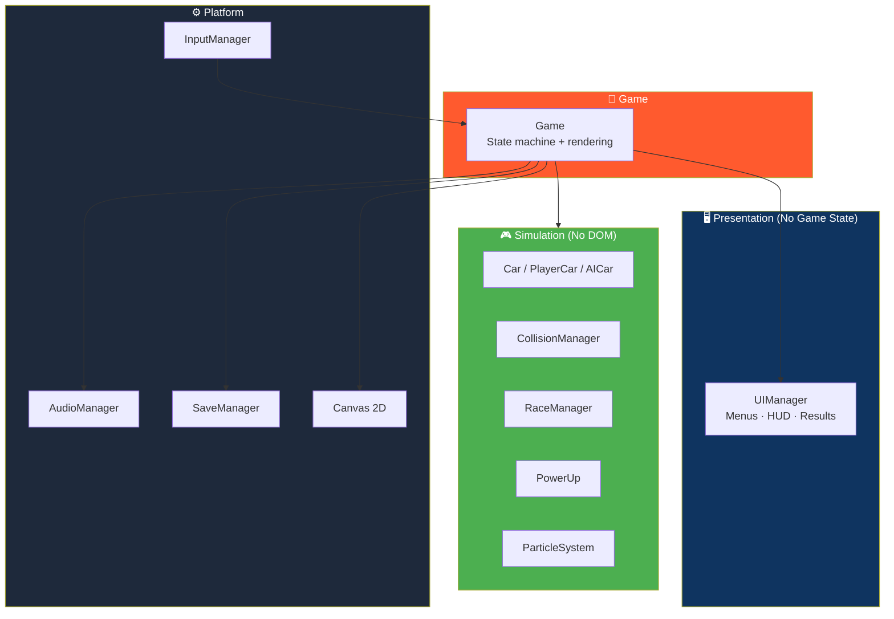

# 🏎️ PIXEL RACER

<div align="center">


**A top-down, pixel-art arcade racer inspired by early-2000s Nokia / Java mobile games.**

*Pick a car. Choose a track. Race three laps against four AI opponents.*

[🎮 Play Now](https://ypengly.github.io/Pixel-racer/) • [✨ Features](#-features) • [🏗️ Architecture](#-architecture) • [🎓 What I Learned](#-what-i-learned) • [🚀 Run Locally](#-how-to-run-locally)

</div>

---

## 🎮 Play Now

<div align="center">

### 🌐 **[▶ PLAY PIXEL RACER →](https://ypengly.github.io/Pixel-racer/)**

*Runs in any modern browser — desktop, tablet, or phone. No download, no install, no sign-up.*

[](https://ypengly.github.io/Pixel-racer/)

</div>

> 💡 **Tip:** Fully playable on mobile with on-screen touch controls. Works offline after first load.

---

## 📖 Project Overview

**Pixel Racer** is a love letter to the golden age of pocket racing games — the era of Nokia handsets, Java midlets, and tiny screens that still managed to feel fast.

You pick a car in the garage, choose one of five tracks, and race **three laps against four AI opponents**. Progress (tracks + cars) and high scores persist between sessions via `LocalStorage`.

The whole game renders to a **fixed 240×320 internal canvas** — the same portrait resolution a Nokia-era handset screen might have used — then scales that canvas up to fit whatever screen it's running on, **without ever distorting the aspect ratio**.

### Core Idea

> **Small canvas. Big feel.**
>
> Every visual is drawn procedurally. Every sound is synthesized. Everything runs from a single `index.html` — no build step, no dependencies.

---

## ✨ Features

<div align="center">

| 🏁 Five Hand-Built Tracks | 🏎️ Four Unlockable Cars |
|:---:|:---:|
| Oval · City · Desert · Snow · Night circuit — each with its own surface, obstacles, and challenge | Different speed, acceleration, handling, and nitro stats — unlocked by winning races |
| **🤖 Four AI Opponents** | **⚡ Power-Ups & Hazards** |
| Balanced · Fast · Aggressive · Slow & Steady — each with distinct personalities | Nitro meter · Shield · Repair · Coins · Cones · Tires · Oil · Rocks · Barrels |
| **🏆 Progression & High Scores** | **🔊 Procedural Retro Audio** |
| Win a race to unlock the next track · Arcade-style top-5 leaderboard with 3-letter initials | All SFX and engine hum synthesized live with Web Audio API — no audio files |
| **📱 Responsive Controls** | **💾 Persistent Progress** |
| Keyboard, mouse, and on-screen touch controls · Smooth scaling for any screen | Tracks, cars, wins, and high scores saved to `LocalStorage` |

</div>

### Detailed Feature List

- **5 hand-built tracks** — oval, city, desert, snow, and a night circuit — each with a different surface, obstacle set, and challenge (narrow corners, slippery ice, low visibility…)
- **Arcade car physics** with drifting, off-road slowdown, and per-surface grip
- **4 AI opponents** with distinct personalities — Balanced · Fast · Aggressive · Slow & Steady — using simple lookahead steering and occasional "mistakes"
- **Nitro meter, power-ups** (shield / repair / coin) and **static hazards** (cones, tires, oil, rocks, barrels)
- **Lap counter, live position, race timer**, particle effects, and screen shake
- **Garage with 4 unlockable cars** — each with different speed/accel/handling/nitro stats
- **Track progression** — win a race to unlock the next track
- **Arcade-style high-score table** with 3-letter initials entry
- **Fully synthesized retro sound effects** — Web Audio oscillators and noise. No external audio files, no copyrighted music
- **Keyboard, mouse, and touch controls** — responsive scaling for desktop, tablet, and mobile

---

## 🎮 Controls

| Action | Keyboard | Touch |
|--------|----------|-------|
| **Accelerate** | `↑` / `W` | ▲ button |
| **Brake / Reverse** | `↓` / `S` | ▼ button |
| **Steer** | `←` `→` / `A` `D` | ◀ ▶ buttons |
| **Nitro Boost** | `Space` | N button |
| **Menu Navigate** | `↑` `↓` `←` `→` | tap |
| **Menu Confirm / Back** | `Enter` / `Esc` | tap |

---

## 🏗️ Architecture

### No Bundler, No Modules — By Design

Everything is plain **ES2017 classes and objects**, loaded as ordinary `<script>` tags. This keeps the game **runnable straight from `file://`** with zero setup.

The **load order in `index.html` doubles as the dependency graph**:

```
constants.js         shared config + math helpers
save.js              SaveManager      — all LocalStorage reads/writes
audio.js             AudioManager     — synthesized SFX + engine hum
particleSystem.js    ParticleSystem   — smoke/sparks/exhaust/confetti
input.js             InputManager     — keyboard + touch → one input state
track.js             track geometry helpers + the 5 track definitions
trackManager.js      TrackManager     — owns tracks + unlock progression
car.js               Car              — shared arcade physics/rendering
playerCar.js         PlayerCar        — reads InputManager
aiCar.js             AICar            — path-following AI + personalities
collisionManager.js  CollisionManager — walls / obstacles / car-vs-car
powerUp.js           PowerUp          — pickup effects + icon/obstacle art
scoreManager.js      ScoreManager     — turns race stats into a score
raceManager.js       RaceManager      — countdown, grid, standings, finish
uiManager.js         UIManager        — every DOM menu/HUD/results screen
game.js              Game             — state machine + canvas rendering
main.js              entry point, responsive scaling, bootstraps Game
```

### Clean Separation of Concerns



> **The rule:** Gameplay logic (everything above `uiManager.js`) **never touches the DOM**. `UIManager` **never touches game state directly**. `Game` is the only class that talks to both sides — which keeps the simulation **testable in isolation**.

### The Game Loop

`Game._loop(now)` runs on `requestAnimationFrame` and does the classic:

```
input → update → physics → collision → AI → particles → render
```

Delta time is measured every frame and **clamped** (`CONFIG.MAX_STEP`) so a dropped frame — tab switch, GC pause — can't fling a car across the map. All motion is expressed as **units per second**, not units per frame.

---

## ⚙️ Physics — Blending, Not Forces

Each `Car` stores a position, a facing angle, and a scalar `speed` along that facing direction.

- **Throttle / brake** change `speed`
- **Steering** rotates the facing angle (scaled down at low speed, so the car doesn't spin in place)
- The actual velocity vector is then **blended** toward `forward × speed` every frame by a **grip** factor:

```js
this.vx = lerp(this.vx, desiredVx, blend);
this.vy = lerp(this.vy, desiredVy, blend);
```

### Why This Feels Good

| Grip Value | Behavior |
|-----------|----------|
| **Near 1** | Velocity snaps to facing direction almost immediately — a "safe" arcade feel |
| **Lower** (off-road, ice, oil slick) | Old velocity is retained longer — this produces sliding and drifting with almost no extra code |

Track surface — road / grass / sand / snow — is looked up every frame by finding the **nearest point on the track's centerline** and comparing distance to `roadWidth / 2`.

---

## 💥 Collision Detection

| Type | Method |
|------|--------|
| **Track boundary** | If a car strays more than `roadWidth/2 + shoulder` from the nearest centerline point, it's clamped back and its velocity is **reflected off the boundary normal** (`bounceOffBarrier`) |
| **Obstacles** | Circle-vs-circle. Solid obstacles push the car out and cut its speed. **Oil slicks** instead grant a temporary "slide" — a grip penalty with no positional correction |
| **Car vs car** | Circle-vs-circle with soft positional + velocity correction, so cars separate instead of overlapping |
| **Anti-spam** | A short per-car `collisionCooldown` stops a single overlap from re-triggering the same impact (and its sound/particles) every frame |

---

## 🤖 AI System

The AI is **deliberately simple and reliable** rather than clever.

Every frame, each `AICar`:

1. Looks at a point on the track's centerline **a little ahead** of itself (further ahead at higher speed)
2. **Steers toward it**
3. **Eases off the throttle** when the road curves sharply just ahead

A slowly drifting **"lane offset"** makes cars weave across the road width, which reads as overtaking attempts without any real path-planning.

**Personality** — `speed multiplier`, `mistake chance`, `lane-change rate` — is just a few numbers layered on top of that one behavior.

---

## 💾 LocalStorage

All persistence goes through **`SaveManager`** (`save.js`) under a **single namespaced key**, so nothing else in the game touches `localStorage` directly.

**What's persisted:**

- Unlocked tracks and cars
- Currently selected car
- Total race wins (used to unlock cars)
- Sound on/off
- Top-5 high scores

---

## 🚀 How to Run Locally

**No build step, no server required** for basic play:

```bash
# macOS
open index.html

# Windows
start index.html
```

### If Your Browser Blocks `file://` Script Loading

Serve the folder instead:

```bash
python3 -m http.server 8000
# then visit http://localhost:8000
```

---

## 🎓 What I Learned

This project taught me four lessons worth writing down.

### 1. Arcade "feel" is a *blending* problem, not a *force* problem

My first pass at the car physics used real acceleration/friction forces, and it felt **sluggish and floaty** — closer to a boat than a Nokia racer.

Swapping to **"blend current velocity toward the car's forward direction by a grip factor"** made drifting, snappy turning, and surface-dependent handling fall out of **one line of code** instead of a small physics engine.

### 2. A single source of truth for "where am I on the track" simplifies everything downstream

Once every car tracks its **nearest centerline index** each frame, four separate systems become simple lookups against that one number:

- Lap counting
- Standings / position
- AI steering targets
- Surface detection

Instead of four systems each re-deriving track position their own way.

### 3. Decoupling simulation from presentation paid off immediately

Because `Car` / `AICar` / `RaceManager` / `CollisionManager` **never touch the DOM**, I could **headlessly simulate full races** in a plain Node script — no browser — while building this.

I drove **hundreds of simulated frames per track** to catch NaNs and stuck-car bugs **long before ever opening it in a browser**.

### 4. Responsive pixel-art is a *scaling-context* problem

Rather than recalculating dozens of hard-coded pixel sizes for the UI on every resize, I set a **single `font-size`** on the game's outer container — derived from how much the 240×320 canvas got scaled up — and expressed every UI measurement in `em`.

The whole interface — text, bars, buttons — **scales together, in one place, for free**.

---

## 🌐 Browser Support

| Browser | Status |
|---------|--------|
| Chrome (desktop) | ✅ Full Support |
| Firefox (desktop) | ✅ Full Support |
| Safari (desktop) | ✅ Full Support |
| Edge (desktop) | ✅ Full Support |
| iOS Safari | ✅ Full Support |
| Android Chrome | ✅ Full Support |

> Requires a browser with **Canvas 2D** and **Web Audio API** support. If audio is unavailable, the game silently continues without sound.

---

## 🗺️ Roadmap

### ✅ Current

- [x] Five hand-built tracks with unique surfaces and challenges
- [x] Four unlockable cars with distinct stats
- [x] Four AI opponents with distinct personalities
- [x] Arcade car physics with drifting and per-surface grip
- [x] Nitro meter, power-ups, and static hazards
- [x] Lap counter, live position, race timer
- [x] Particle effects and screen shake
- [x] Garage and track progression
- [x] High-score table with 3-letter initials
- [x] Fully synthesized retro audio
- [x] Keyboard, mouse, and touch controls
- [x] Responsive scaling for any screen
- [x] LocalStorage persistence

### 🔜 Future Ideas

- [ ] Track editor
- [ ] Ghost replays (record and race against your best lap)
- [ ] Time trial mode
- [ ] Additional car classes (heavy, lightweight, prototype)
- [ ] Weather variations per track
- [ ] Online leaderboard
- [ ] Gamepad support
- [ ] Additional tracks

---

## 🤝 Contributing

Contributions are welcome. Please:

1. Fork the repository
2. Keep it **build-free** — no bundlers, no modules, no npm
3. Preserve the **simulation/presentation split** — no DOM access from gameplay code
4. Test on both desktop and mobile
5. Submit a Pull Request

### Guidelines

- **Never add a required external dependency**
- **Never allow gameplay code to touch the DOM**
- **Keep it runnable from `file://`** — that's the whole point
- **Preserve the 240×320 internal canvas** — that's the aesthetic

---

## 📜 License

MIT — free to use, modify, and distribute.

---

## 🙏 Acknowledgments

- **Nokia / Java mobile racing games** — the original inspiration
- **Canvas 2D** — for making procedural pixel art this pleasant
- **Web Audio API** — for a game with zero audio files
- **Every player who beat their own lap time** — this game is for you

---

<div align="center">

### 🏎️ PICK A CAR. PICK A TRACK. RACE.

**Small canvas. Big feel. Zero dependencies.**

<br>

### 🌐 **[▶ PLAY NOW →](https://ypengly.github.io/Pixel-racer/)**

<br>

⭐ If you enjoyed this game, consider giving it a star.

<br>

[⬆ Back to Top](#️-pixel-racer)

</div>
